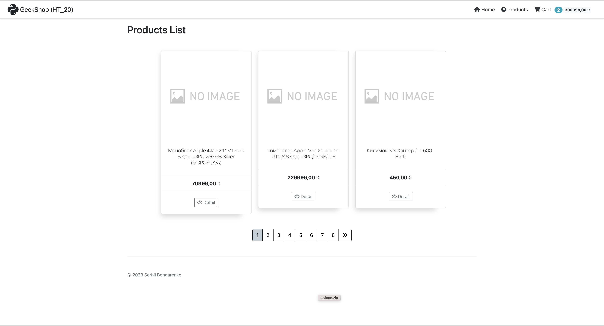

Доробити попереднє ДЗ (19):
1. Додати сторінку корзини.
2. 
   * імплементувати додавання продукта до корзини,
   * зміну кількості продукта (перевіряти на від'ємне значення як введеного значення, так і отриманої кількості),
   * видалення одного продукта,
   * очищення всієї корзини.

